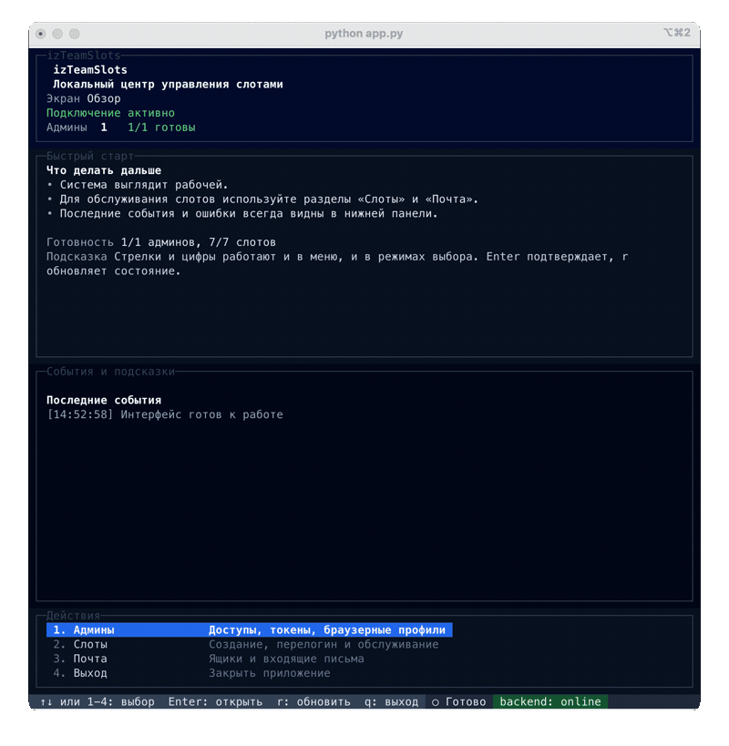

<div align="center">

# izTeamSlots

**Локальный менеджер ChatGPT Team слотов: админы, инвайты, регистрация, перелогин и Codex-сессии**

[](https://github.com/izzzzzi/izTeamSlots/actions/workflows/ci.yml)
[](https://github.com/izzzzzi/izTeamSlots/actions/workflows/release.yml)
[](https://www.npmjs.com/package/izteamslots)
[](LICENSE)
[](https://python.org/)
[](https://www.typescriptlang.org/)
[](https://bun.sh/)

<br />



</div>

## Quick Start

```bash
npm install -g izteamslots@latest
izteamslots
```

Дальше:
1. Откройте `Настройки` и задайте почтовый провайдер / API-ключ.
2. Добавьте админа через ручной вход в браузере.
3. Запустите создание слотов.

## Что умеет

- Добавление и ручной перелогин админов.
- Создание слотов: `почта -> инвайт -> регистрация -> OAuth`.
- Перелогин одного слота или всех сразу.
- Сохранение `codex-<email>-Team.json`.
- Логи, локальные browser profiles и doctor-проверка.
- Синхронизация workspace с локальными слотами.

## Ограничения

- Вход админа сейчас поддерживается только в ручном режиме.
- Проект зависит от текущего web UI OpenAI / ChatGPT.
- Браузерная автоматизация может ломаться после изменений на стороне сайта.
- Токены, профили браузера и `codex` хранятся локально.
- Основные платформы: macOS и Windows.

## Где лежат данные

При глобальной установке данные сохраняются в `~/.izteamslots`.

- `accounts/` — аккаунты и browser profiles
- `codex/` — сохранённые codex-файлы
- `logs/` — app/job logs
- `.env` — локальные настройки

Примеры:
- Windows: `C:\Users\<USER>\.izteamslots`
- macOS / Linux: `~/.izteamslots`

Если вы обновляете старую версию, `codex`-файлы могут временно лежать ещё и внутри директории пакета. В актуальной версии основным путём считается именно `~/.izteamslots`.

## Настройка

Настройки можно задать через меню `Настройки` внутри приложения или вручную через `~/.izteamslots/.env`.

```bash
# Linux / macOS
mkdir -p ~/.izteamslots
echo "BOOMLIFY_API_KEY=your_api_key" > ~/.izteamslots/.env

# Windows (PowerShell)
mkdir "$env:USERPROFILE\.izteamslots" -Force
echo "BOOMLIFY_API_KEY=your_api_key" > "$env:USERPROFILE\.izteamslots\.env"
```

| Переменная | По умолчанию | Описание |
|-----------|:------------:|----------|
| `BOOMLIFY_API_KEY` | — | API-ключ Boomlify |
| `BOOMLIFY_DOMAIN` | авто | Домен временных почт |
| `BOOMLIFY_TIME` | `permanent` | Время жизни ящика |
| `SLOT_MAIL_PROVIDER` | `boomlify` | Провайдер почты для слотов |
| `MAIL_PROVIDER` | `trickads` | Провайдер почты для админов |

## Почтовые провайдеры

- В проект уже встроены `boomlify`, `trickads` и `imap`.
- Можно добавлять собственные почтовые провайдеры.
- Для этого нужно реализовать `MailProvider` и зарегистрировать его в backend.

Подробности: [docs/providers.md](./docs/providers.md)

## Документация

- [docs/providers.md](./docs/providers.md) — встроенные и кастомные почтовые провайдеры
- [docs/architecture.md](./docs/architecture.md) — структура проекта, архитектура и пайплайн слотов
- [docs/troubleshooting.md](./docs/troubleshooting.md) — частые проблемы и способы диагностики
- [CONTRIBUTING.md](./CONTRIBUTING.md) — вклад в проект, проверки и тесты

## Разработка

```bash
ruff check backend tests
python -m unittest discover -s tests -p 'test_*.py'
npm --prefix ui run test
npm --prefix ui run typecheck
```

## Лицензия

MIT
