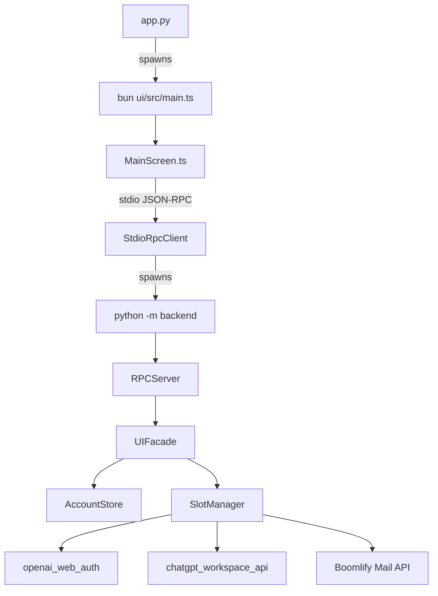
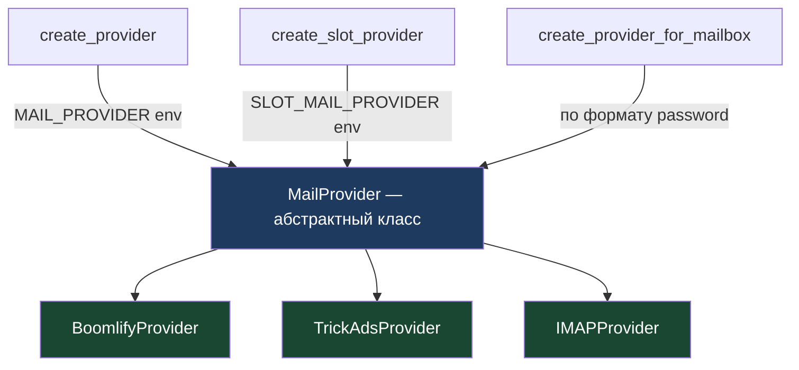
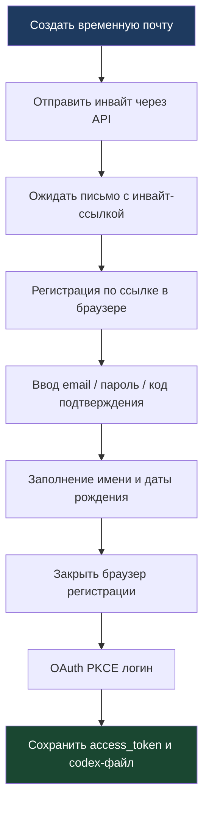

<div align="center">

# izTeamSlots

**Менеджер ChatGPT Team слотов с авто-регистрацией через временную почту и обновлением Codex-сессий**

[](https://github.com/izzzzzi/izTeamSlots/actions/workflows/ci.yml)
[](https://github.com/izzzzzi/izTeamSlots/actions/workflows/release.yml)
[](https://www.npmjs.com/package/izteamslots)
[](LICENSE)
[](https://python.org/)
[](https://www.typescriptlang.org/)
[](https://bun.sh/)

<br />


</div>

---

## Обзор

**izTeamSlots** — локальное приложение с архитектурой:

- **Python backend** (бизнес-логика, браузерная автоматизация, storage);
- **TypeScript OpenTUI frontend** (терминальный интерфейс оператора).

---

## Возможности

- Управление админами: добавить, перелогинить, удалить, открыть браузерный профиль.
- Пайплайн слотов: `создать почту -> инвайт -> регистрация -> OAuth-логин`.
- Перелогин слотов: одного выбранного или всех по очереди.
- Codex-файлы: авто-сохранение `codex-<email>-Team.json` в аккаунт и в `./codex/`.
- Doctor-проверка: валидация/восстановление файловой структуры аккаунтов при старте.
- Просмотр почты: входящие письма для админов и слотов.

---

## Структура проекта

```text
izTeamSlots/
├── app.py                          # Entrypoint: запускает UI
├── backend/                        # Весь Python-бэкенд
│   ├── __init__.py                 # PROJECT_ROOT
│   ├── __main__.py                 # python -m backend
│   ├── account_store.py            # CRUD аккаунтов (JSON storage)
│   ├── mail/                       # Почтовые провайдеры (плагины)
│   │   ├── __init__.py             # Фабрики: create_provider, create_slot_provider
│   │   ├── base.py                 # MailProvider ABC, Mailbox, Mail, Inbox
│   │   ├── boomlify.py             # Boomlify Temp Mail API
│   │   ├── trickads.py             # trickadsagencyltd.com temp mail
│   │   └── imap.py                 # Любой IMAP-сервер
│   ├── openai_web_auth.py          # Браузерная автоматизация (SeleniumBase)
│   ├── chatgpt_workspace_api.py    # ChatGPT Workspace API через браузер
│   ├── slot_orchestrator.py        # Оркестратор пайплайна слотов
│   ├── dto.py                      # DTO для UI
│   ├── jobs.py                     # Задачи в потоках
│   ├── rpc_protocol.py             # JSON-RPC протокол
│   ├── rpc_server.py               # RPC-сервер (stdio)
│   └── ui_facade.py                # Фасад между RPC и бизнес-логикой
├── ui/                             # TypeScript TUI (OpenTUI)
│   ├── package.json
│   └── src/
│       ├── main.ts                 # Entrypoint UI
│       ├── screens/MainScreen.ts   # Главный экран
│       ├── transport/stdioClient.ts # JSON-RPC клиент
│       └── menus/                  # Меню, таблицы, форматирование
├── accounts/                       # Данные аккаунтов (runtime)
├── codex/                          # Codex-файлы (runtime)
└── README.md
```

---

## Установка

### npm (рекомендуется)

```bash
npm install -g izteamslots
```

Или запуск без установки:

```bash
npx izteamslots
```

### Из исходников

```bash
git clone https://github.com/izzzzzi/izTeamSlots.git
cd izTeamSlots
npm install
```

`npm install` / `postinstall` автоматически:
- Проверит Python 3.11+
- Установит [uv](https://docs.astral.sh/uv/) если его нет (быстрый Python package manager)
- Установит Python-зависимости через uv (`seleniumbase`, `requests`)
- Установит [Bun](https://bun.sh) если его нет + UI-зависимости
- Создаст `.env` из `.env.example` если его нет

> Chrome и chromedriver скачиваются автоматически при первом запуске через SeleniumBase.

Если нужно перезапустить setup вручную:

```bash
npm run setup
```

### Настройка .env

```bash
# Temp mail API (обязательно для создания слотов)
BOOMLIFY_API_KEY=your_api_key
```

Опциональные переменные:

| Переменная | По умолчанию | Описание |
|-----------|:------------:|----------|
| `BOOMLIFY_DOMAIN` | авто | Домен для временных почт |
| `BOOMLIFY_TIME` | `permanent` | Время жизни ящика |
| `SLOT_MAIL_PROVIDER` | `boomlify` | Провайдер почты для слотов |
| `MAIL_PROVIDER` | `trickads` | Провайдер почты для админов |

## Запуск

```bash
# Глобальная установка
izteamslots

# Из исходников
npm start
```

Это запустит OpenTUI frontend через **Bun**, который поднимет Python RPC backend (`python -m backend`) по `stdio`.

---

## Архитектура



## Почтовые провайдеры (плагины)

Система почты построена на плагинах — абстрактный класс `MailProvider` и конкретные реализации.



### Встроенные провайдеры

| Провайдер | Модуль | Описание | Env-переменные |
|-----------|--------|----------|----------------|
| `boomlify` | `mail/boomlify.py` | Boomlify Temp Mail API (по умолчанию для слотов) | `BOOMLIFY_API_KEY`, `BOOMLIFY_DOMAIN`, `BOOMLIFY_TIME` |
| `trickads` | `mail/trickads.py` | trickadsagencyltd.com temp mail (по умолчанию для админов) | — |
| `imap` | `mail/imap.py` | Любой IMAP-сервер | `IMAP_HOST`, `IMAP_PORT`, `IMAP_SSL`, `IMAP_FOLDER` |

### Фабричные функции

- `create_provider(name)` — создаёт провайдер по имени (или `MAIL_PROVIDER` env, по умолчанию `trickads`)
- `create_slot_provider(name)` — для слотов (`SLOT_MAIL_PROVIDER` env, по умолчанию `boomlify`)
- `create_provider_for_mailbox(mailbox)` — автоопределение по формату пароля (если `boomlify:<uuid>` → Boomlify)

### Свой провайдер

Наследуйте `MailProvider` из `backend/mail/base.py` и реализуйте два метода:

```python
from backend.mail.base import MailProvider, Mailbox, Inbox

class MyProvider(MailProvider):
    name = "my_provider"

    def generate(self) -> Mailbox:
        # создать временный ящик, вернуть Mailbox(email, password)
        ...

    def inbox(self, mailbox: Mailbox) -> Inbox:
        # получить письма, вернуть Inbox(email, messages=[Mail(...), ...])
        ...
```

---

## Пайплайн слотов



---

## Важно

- Проект хранит токены и браузерные профили локально на диске.
- Не публикуйте папки `accounts/` и `codex/` в публичные репозитории.
- Для стабильной работы перелогина у worker должен быть `openai_password`.

---

## Участие в разработке

См. [CONTRIBUTING.md](CONTRIBUTING.md).
