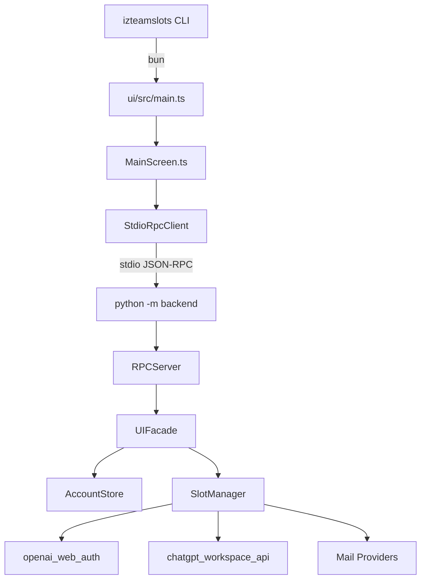
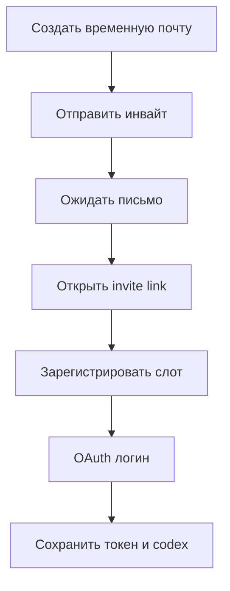

# Архитектура

## Общая схема

`izTeamSlots` состоит из двух основных частей:

- Python backend: бизнес-логика, storage, браузерная автоматизация, почта, workspace API
- TypeScript OpenTUI frontend: интерфейс оператора в терминале

## Поток запуска



## Ключевые модули

- `backend/account_store.py` — хранение админов и слотов
- `backend/slot_orchestrator.py` — оркестратор создания слотов и sync workspace
- `backend/openai_web_auth.py` — browser automation и OAuth/web-session flow
- `backend/chatgpt_workspace_api.py` — backend-api ChatGPT через браузерную сессию
- `backend/rpc_server.py` — JSON-RPC сервер по stdio
- `backend/ui_facade.py` — фасад между TUI и backend
- `ui/src/screens/MainScreen.ts` — главный TUI экран

## Структура проекта

```text
izTeamSlots/
├── backend/             # Python backend
├── ui/                  # OpenTUI frontend
├── bin/                 # CLI entrypoint
├── scripts/             # setup scripts
├── tests/               # Python unit tests
├── ui/tests/            # TypeScript unit tests
└── .github/workflows/   # CI/CD
```

## Пайплайн слотов



## Данные

При глобальной установке runtime-данные живут в `~/.izteamslots`:

- `accounts/`
- `codex/`
- `logs/`
- `.env`
